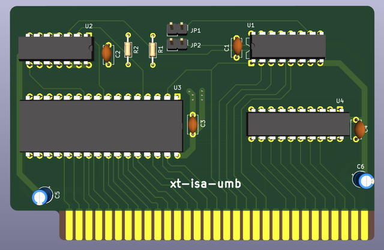

### Simple UMB memory expansion for IBM PC (XT) and clones.

With this card, you can add 128 kB of continuous UMB memory in the D0000 - EFFFF area, or only 64 kB in the D0000 - DFFFF or E0000 - EFFFF areas. 

* Original schematic diagram was drawn by Ruud Baltissen (VCF forum thread): https://forum.vcfed.org/index.php?threads/loading-dos-high-on-a-xt.32320/
* The idea for the printed circuit board layout borrowed from Adrian Black: https://github.com/misterblack1/isa-ram-expansion
* 8 bit ISA footprint from Sergey Kiselev: https://github.com/skiselev/my_kicad_library

Diagram/PCB drawn by me in KiCad 9.0, the only minor change from Ruud's schematic is the addition of a 74LS245 buffer for the data bus (as done by Adrian and in the Lo-tech 1MB RAM Board https://www.lo-tech.co.uk/wiki/Lo-tech_1MB_RAM_Board).

# **Please note, not yet tested!**
